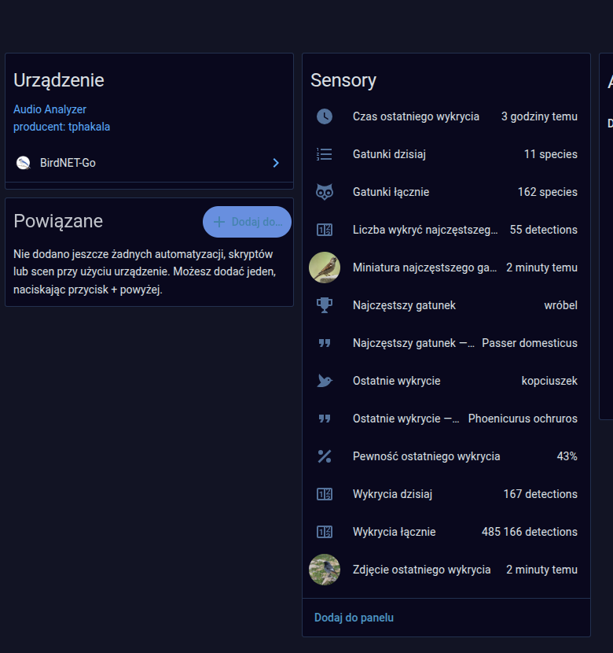
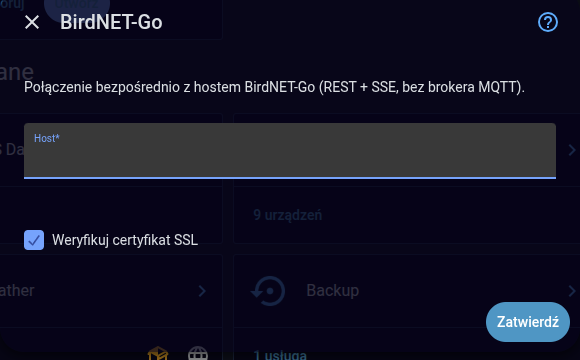
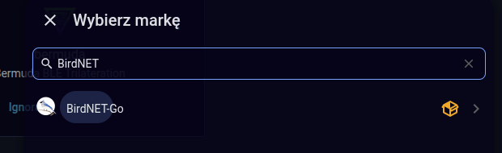

# BirdNET-Go — Home Assistant Integration

A custom Home Assistant integration for [BirdNET-Go](https://github.com/tphakala/birdnet-go). Connects **directly to your BirdNET-Go host** over REST + SSE — no MQTT broker required.

  
  

Screenshots from a live install — real detection data (BirdNET-Go host redacted). Full UI, entity list and setup dialog automatically switch to your Home Assistant's language (English + Polish translations ship today, see [Localization](#localization)).

## Why no MQTT

BirdNET-Go has built-in MQTT auto-discovery (since nightly-20260111), but that's still an indirect path: BirdNET-Go → broker → HA's MQTT integration → entities, with the broker as an extra dependency. BirdNET-Go's REST API v2 also exposes `GET /api/v2/detections/stream` — a public SSE endpoint (Server-Sent Events, no auth, rate-limited to 10 connections/min/IP) that pushes new detections the instant they happen. Combined with REST polling for the slower-moving stats, this integration talks to BirdNET-Go directly — one less moving part in the chain.

## Architecture

- **`coordinator.py`** — a `DataUpdateCoordinator` with two data paths:
  - REST polling every 5 min (`/api/v2/analytics/species/daily`) and every hour (`/api/v2/analytics/species/summary`)
  - a background task reading `/api/v2/detections/stream` (SSE), reconnecting with exponential backoff (5s→120s), calling `async_set_updated_data()` on every new detection
- **`config_flow.py`** — add via the UI: host + verify SSL, validated against `GET /api/v2/detections/recent?limit=1`
- **`sensor.py`** / **`binary_sensor.py`** / **`image.py`** — a single "BirdNET-Go" device with 11 sensors, 2 image entities, 1 connectivity binary_sensor

All entities are enabled by default — nothing hidden behind "show disabled entities".

## Entities

| Entity | Source |
|---|---|
| `sensor.birdnet_go_last_detection` (+ scientific name, time, confidence) | SSE push |
| `sensor.birdnet_go_detections_today` / `species_today` | REST, every 5 min |
| `sensor.birdnet_go_top_species` (+ scientific name, count) | REST, every 5 min |
| `sensor.birdnet_go_total_species` / `total_detections` | REST, hourly |
| `image.birdnet_go_last_detection_image` | SSE push |
| `image.birdnet_go_top_species_thumbnail` | REST, every 5 min |
| `binary_sensor.birdnet_go_status` | connectivity — last REST/SSE contact succeeded |

The two `image` entities are HA's proper `image` platform, not a URL-string sensor — HA fetches and caches the picture itself and serves it back through its own `/api/image_proxy/...` endpoint, so it stays reachable even when the browser has no direct network path to the BirdNET-Go host.

## Installation

### HACS (custom repository)
1. HACS → ⋮ → Custom repositories → add this repo URL, category **Integration**
2. Install "BirdNET-Go", restart Home Assistant

### Manual
Copy `custom_components/birdnet_go/` into your HA `config/custom_components/`, restart.

Then: **Settings → Devices & Services → Add Integration → "BirdNET-Go"** (pictured above), enter your BirdNET-Go host (e.g. `192.168.1.50:8080` or a domain if you reverse-proxy it with HTTPS).

  

## Localization

HA picks `translations/<lang>.json` by the user's own HA language setting — nothing to configure. Currently shipped: `en`, `pl`. Contributions for more languages welcome (PR against `custom_components/birdnet_go/translations/`, `strings.json` is the English source of truth).

## Status

Running live against a real BirdNET-Go instance (screenshots above are from that install). `manifest.json`/`config_flow`/translations/brand assets are validated in CI (hassfest + HACS action, see badge at the top).

## License

MIT — see [LICENSE](LICENSE).
